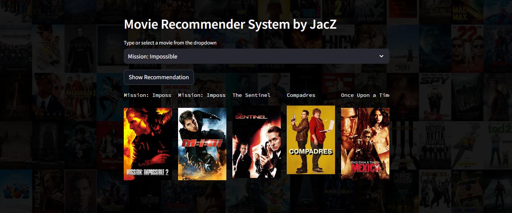

# JacZ Movie Recommender System

## Overview

Recommendation systems are essential in our busy lives, helping us make quick and informed choices. With limited time to sift through endless options, these systems use AI algorithms to curate personalized lists of content tailored to each individual. By analyzing user profiles, search history, and viewing patterns of similar users, recommendation systems predict and suggest relevant and interesting items. This personalization makes it easier to find content that matches our preferences without overwhelming our cognitive resources.

## Types of Recommendation Systems

### 1 ) Content-Based :

Content-based recommender systems use past information and consider item attributes to suggest similar items.

- Twitter, YouTube: Platforms that utilize recommendation systems to suggest content.

- Music Preferences: These systems analyze which music you're listening to and which singers you're watching, forming embeddings for the features.

- User Actions and Item Recommendations: They make recommendations based on user-specific actions or similar items.

- Vector Creation: The system creates a vector of user interactions and item attributes.

Recommendation Hypothesis: These systems hypothesize that if a user was interested in an item in the past, they will likely be interested in it again in the future.

Specialization Issue: A challenge arises with excessive specialization, where the system makes obvious recommendations within limited categories (e.g., user A is only recommended items in categories B, C, and D) and fails to suggest potentially interesting items outside those categories.

### 2 ) Collaborative Filtering :
		
Collaborative filtering systems are based on user-item interactions.

- User Clusters: They group users with similar ratings or preferences.

- Book Recommendations: Utilize clustering mechanisms for suggesting books.

- Single Parameter: They typically use one parameter, such as ratings or comments.

Basic Assumption: Collaborative filtering assumes that if user A likes item X and user B likes item X and item Y, then user A might also like item Y.
	
- Issues are :
    - Computational Expense: The user-item matrix can be large and computationally expensive.
    - Popularity Bias: Only well-known items tend to get recommended.
    - Cold Start Problem: New items may not get recommended at all.  

### 3 ) Hybrid-Based :
	
Hybrid systems combine both collaborative filtering and content-based methods to avoid the limitations of using just one approach.

- Modern Usage: They are commonly used today for their improved accuracy and robustness.

- Techniques: Hybrid systems utilize techniques like word2vec and embeddings to enhance recommendations.


## About This Project
This project employs a content-based recommendation approach to suggest movies based on their tags and overviews. By utilizing cosine similarity to measure the similarities between movies, it identifies and recommends the top 5 movies with the highest similarity scores relative to the selected movie.

* [Click here to run it live on server](https://jacz-movie-recommender-system-16cdc3ac7172.herokuapp.com/)

### Demo:




## Usage
1. Clone this repository to your local machine:
```
git clone https://github.com/titoausten/jacz-movie_recommender_system.git
```

2. Install requirements:
```
pip install -r requirements.txt

```

3. Run script:
```
streamlit run app.py
```

## License
This project is licensed under the MIT License. See the LICENSE file for more details.